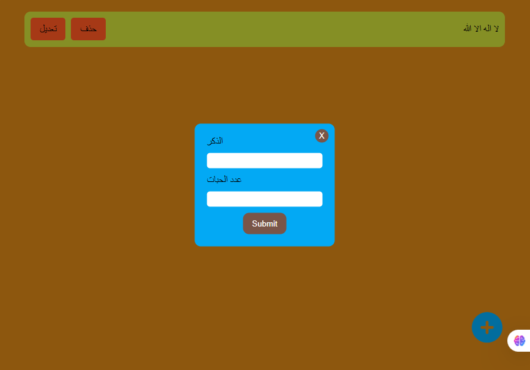

## 🎯 Purpose
The Tasbeeh App is a lightweight, interactive digital tool designed to help users perform daily dhikr (remembrance of Allah) in a simple and intuitive way. It replicates the experience of traditional prayer beads, allowing users to count recitations, reset the counter, and switch between different types of dhikr.

## 🧠 Architecture – Object-Oriented Design
The application is structured using Object-Oriented Programming (OOP) principles to ensure modularity, scalability, and maintainability.

## 🛠️ Key Features
- ✅ Increment Counter: Each button press increases the count.

- 🔁 Reset Functionality: Resets the counter to zero.

- 📝 Dhikr Selection: Choose from phrases like “SubhanAllah”, “Alhamdulillah”, “Allahu Akbar”.
- 💾 State Persistence: Saves current count and selected dhikr using localStorage.

- 🎨 Clean UI: Simple and responsive interface using pure HTML and CSS.

## 🌟 Benefits of Using OOP
- Clear separation of concerns between logic and UI.

- Easier to extend with features like themes, sound effects, or analytics.

- Promotes reusable and maintainable code.
